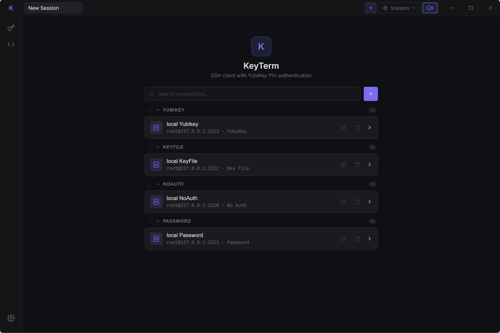

<div align="center">
  <h1>⌨️ KeyTerm</h1>
  <p><strong>A modern SSH client with native YubiKey PIV authentication</strong></p>

  <p>
    
    
    
    
  </p>
</div>

---

## Features

- 🔑 **YubiKey PIV authentication** — full slot management, key generation, PIN/touch policy configuration, and serial number binding
- 🔐 **Multiple auth methods** — YubiKey PIV, SSH key file, password (with system keychain), or none
- 💻 **Full terminal emulation** — xterm.js powered, multi-tab, dynamic resize, 5000-line scrollback
- 🪟 **Split-pane workspace** — split terminal panes inside one tab (right/down), with draggable dividers
- 📁 **Integrated SFTP panel** — per-session remote file browsing, upload/download, and transfer notifications
- 🗂️ **Connection manager** — groups, labels, full-text search
- 📝 **Command snippets** — tag-based library with `Ctrl+K` quick-launch
- 🎥 **Screencast key overlay** — toggle with `Ctrl+Shift+K` / `Cmd+Shift+K`
- 🔒 **Secure credential storage** — native keychain for SSH passwords and storage secrets
- 🛡️ **Host key verification** — TOFU + `~/.ssh/known_hosts` with MITM detection
- 🎨 **Theme switcher** — built-in dark/light UI themes
- 🗄️ **Local-first sync storage** — data is always local-first, cloud backend (S3/WebDAV) is used for sync
- 🌍 **i18n support** — built-in English / Simplified Chinese UI language switch

### Planned

- 🔗 **SSH agent forwarding**
- 📅 **Scheduled tasks / automation hooks**

## Preview



## Installation

Download the latest release for your platform from the public distribution repo, for example:

```text
https://github.com/fullstackoverflow/KeyTerm-Releases/releases
```

| Platform | Installer |
|----------|-----------|
| Windows  | `KeyTerm_x.x.x_x64-setup.exe` (NSIS) or `.msi` |
| macOS    | `KeyTerm_x.x.x_x64.dmg`  |

### macOS Note

Current macOS builds do not include a signing certificate. If you use the macOS package, please extract it and launch the app manually.

## Authentication Methods

| Method | Description |
|--------|-------------|
| **YubiKey PIV** | Hardware-backed auth via PIV slots (9a/9c/9d/9e). Supports PIN and touch policies. |
| **SSH Key File** | RSA, ECDSA, Ed25519 private keys. Auto-selects SHA-256 for RSA. |
| **Password** | SSH password auth with optional save to system keychain. |
| **None** | For servers that allow unauthenticated access. |

## YubiKey Support

KeyTerm has first-class YubiKey PIV support:

- Detect inserted YubiKey (serial, name, firmware version)
- Manage all PIV slots (`9a`, `9c`, `9d`, `9e`, `82`–`95`)
- Generate P-256 ECDSA keys directly on the device
- Configure per-slot **PIN policy** (`never` / `once` / `always`) and **touch policy** (`never` / `always` / `cached`)
- Bind a connection to a specific YubiKey serial to prevent accidental use of the wrong key
- Real-time PIN and touch prompts during authentication

## Tech Stack

| Layer | Technology |
|-------|-----------|
| UI Framework | React 19 + TypeScript |
| Desktop Runtime | Tauri 2 |
| Terminal | xterm.js 6 |
| SSH Client | russh (pure Rust, async) |
| SFTP | russh-sftp |
| YubiKey | yubikey-piv crate |
| Cryptography | p256, sha2, der |
| Storage | Pluggable storage drivers (Local + S3 + WebDAV) |
| Storage Abstraction | Apache OpenDAL |
| Keychain | keyring-rs (native per platform) |
| Build Tool | Vite 7 |

## Keyboard Shortcuts

| Shortcut | Action |
|----------|--------|
| `Ctrl+K` / `Cmd+K` | Toggle snippet drawer |
| `Ctrl+Shift+K` / `Cmd+Shift+K` | Toggle screencast key overlay |
| `Ctrl+Shift+F` / `Cmd+Shift+F` | Toggle SFTP side panel |
| `Ctrl+Alt+Right` / `Cmd+Alt+Right` | Split current pane to the right |
| `Ctrl+Alt+Down` / `Cmd+Alt+Down` | Split current pane downward |
| `Ctrl+W` / `Cmd+W` | Close current pane |
| `Escape` | Close modal / drawer |
| `↑` / `↓` | Navigate snippet list |
| `Enter` | Execute selected snippet |
| Double-click tab | Rename tab |

## Context Menu Policy

- Right-click menus are intentionally enabled only in designed areas:
  - tab items
  - terminal pane area
- In other UI regions, the default system context menu is disabled to avoid accidental menu popups.
  
## License

MIT
